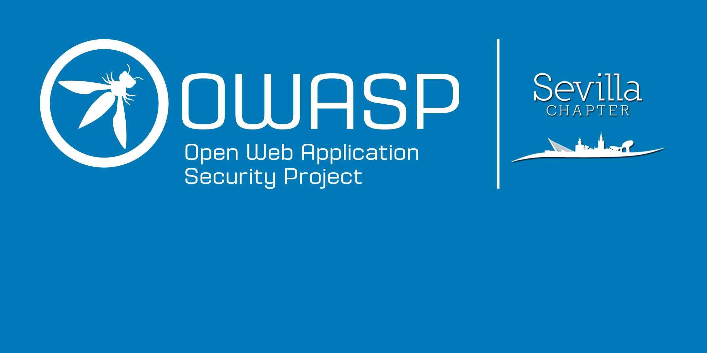
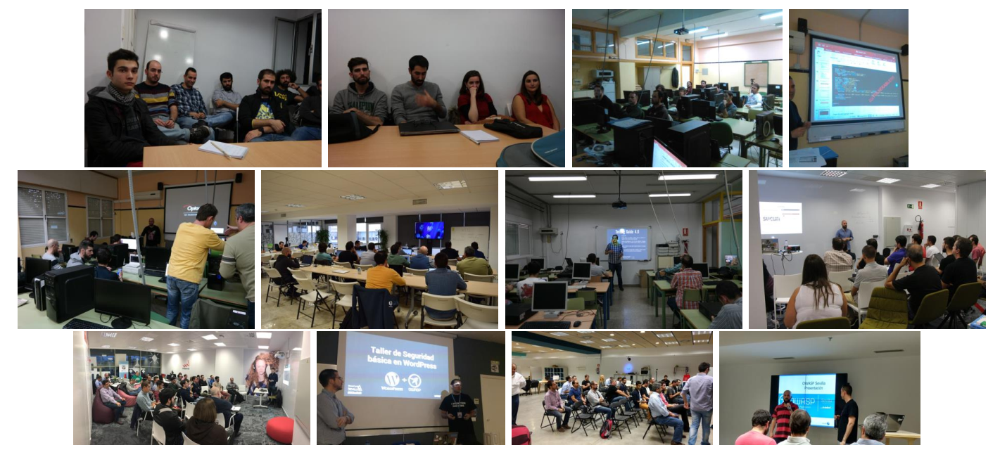

---

layout: col-sidebar
title: OWASP Sevilla
tags: Sevilla
level: 3
region: Europe
country: Spain

---

## OWASP Sevilla

El capítulo de OWASP Sevilla tiene como objetivo formar una comunidad en torno a la seguridad de la información, OWASP es una organización sin ánimo de lucro a nivel internacional que brinda software, metodologías y documentación de rigor profesional bajo licencias Open Source.

## Noticias

Para estar al día de nuestros eventos, visita nuestras redes sociales, tendrás la información más actualizada y podrás hacernos cualquier consulta.

Estamos en contacto por chat en slack, puedes solicitar acceso a través de este [formulario](https://polar-caverns-90777.herokuapp.com/) , debes acceder al canal \#owasp-sevilla. Recuerda que esto es una organización sin ánimo de lucro y puedes participar de forma activa.

Te animamos a que participes, las propuestas de mejora son siempre bienvenidas, cualquier duda que tengas hazla sin temor, recuerda que todos fuimos alguna vez novato.

Nos tienes también en redes sociales:
[Twitter](https://twitter.com/OWASP_Sevilla)
[Facebook](https://m.facebook.com/groups/1697205410565061)
[Eventbrite](https://www.eventbrite.es/o/owasp-sevilla-9895598677)

## Organizadores

Los organizadores de OWASP Sevilla son:

  - [Carmelo Zubeldia](https://twitter.com/czubeldiam)

<!-- end list -->

  - [Ramón Salado](mailto:ramon.salado@owasp.org)

<!-- end list -->

  - [José Luis Núñez](mailto:jnunez@inetsec.es)

<!-- end list -->

  - Juan Jose Domenech

<!-- end list -->

  - Francisco José Ramírez López

Los organizadores son voluntarios, no reciben ninguna retribución por
las tareas que realizan (que no son pocas) ;-), pero aceptan cervezas y
piropos.

# Eventos y reuniones

# Presentaciones y Documentación

[Fotos de Eventos](https://drive.google.com/drive/folders/0B9pYnCCv7eCiODY0aGMySWNDYXM?usp=sharing)

[Presentación Docker+XSS](https://drive.google.com/file/d/0B27X4cLUPgRbY3NNRnlNamtrUGc/view?usp=sharing)

[FaradaySec](https://docs.google.com/presentation/d/1mIrBGp9nfFJol1Bzza70IgQhPp7TBvG77nOGbuPiy5M/edit?usp=sharing)

[Guía de testing](https://drive.google.com/file/d/0B2zLtUkUNXhZa3BKbEZQdm53XzA/view?usp=sharing)

[Sistemas de Recompensas(bugbounty)](https://drive.google.com/open?id=0B2zLtUkUNXhZRjdhbmVvS05Ga0k)

[Hardening WordPress](https://es.slideshare.net/RamnSaladoLucena/owasp-6-seguridad-en-wordpress)

[Anonimator](https://es.slideshare.net/RamnSaladoLucena/anonimator)

[Sistemas Operativos para la privacidad y el anonimato](https://www.slideshare.net/mobile/jjdoms/owasp-sevilla-sistemas-operativos-privacidad-y-anonimato)

[Top10 IOT](https://es.slideshare.net/RamnSaladoLucena/top-10-iot-owasp-hackbeers-sevilla)

# Colaboradores

[IES Isbilya Sevilla](http://www.isbilya.es)

[IES Antonio Machado Sevilla](http://www.juntadeandalucia.es/averroes/centros-tic/41009071/helvia/sitio/index.cgi)

[Bitnami](https://bitnami.com/)

[Programa Minerva](https://www.programaminerva.es/)

[El Cubo, Andalucía Open Future](https://andalucia.openfuture.org/)

[Escuela Técnica Superior de Ingeniería Informática, Universidad de Sevilla](https://www.informatica.us.es/)

<headertabs />

Puedes saber más sobre OWASP, sus Principios y Valores y su Código Ético
en el siguiente enlace: [About OWASP](About_The_Open_Web_Application_Security_Project "wikilink")
